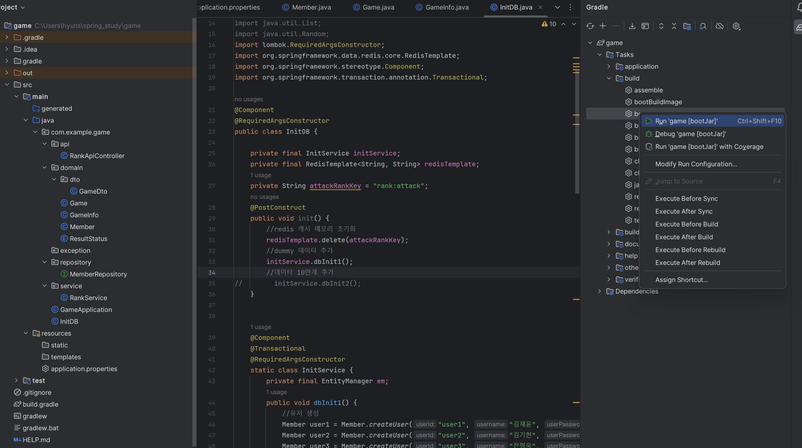

# Docker

## 1. Spring boot 프로젝트 

### STEP1

```Gradle -> Task -> boot.jar 실행```



### STEP2
```build -> libs -> jar 파일 생성```


### [참고]
application.yml 예시

```yaml
spring:
  datasource:
    driver-class-name: com.mysql.cj.jdbc.Driver
    url: jdbc:mysql://localhost:3306/fiveguys?useSSL=false&allowPublicKeyRetrieval=true&serverTimezone=Asia/Seoul&characterEncoding=UTF-8
    username: root
    password: ssafy


  jpa:
    open-in-view: true
    hibernate:
      ddl-auto: update
      naming:
        physical-strategy: org.hibernate.boot.model.naming.PhysicalNamingStrategyStandardImpl
      use-new-id-generator-mappings: false
    show-sql: true
    properties:
      hibernate.format_sql: true
      dialect: org.hibernate.dialect.MySQL8Dialect


logging:
  level:
    org.hibernate.SQL: debug
```

### STEP3
Dockerfile 생성

```docker
FROM openjdk:17-alpine
ARG JAR_FILE=game-0.0.1-SNAPSHOT.jar
COPY ${JAR_FILE} myboot.jar
ENTRYPOINT ["java", "-jar", "/myboot.jar"]
```

**FROM :** 이미지를 생성할 때 사용할 기반 이미지 레이어

**ARG :** 변수 선언

**COPY :** 실행할 jar파일을 도커 컨테이너 내부에 myboot.jar라는 이름으로 복사합니다. 상대 경로로 위치도 같이 설정 가능

**ENTRYPOINT :** 컨테이너가 시작될 때 실행할 스크립트 혹은 명령 정의

#### [참고] 이미지 빌드
```shell
docker build -t [이미지 이름] [Dockerfile 스크립트 파일 경로]
docker build -t springbootapp01 C:\Users\hyuns\docker-image
```